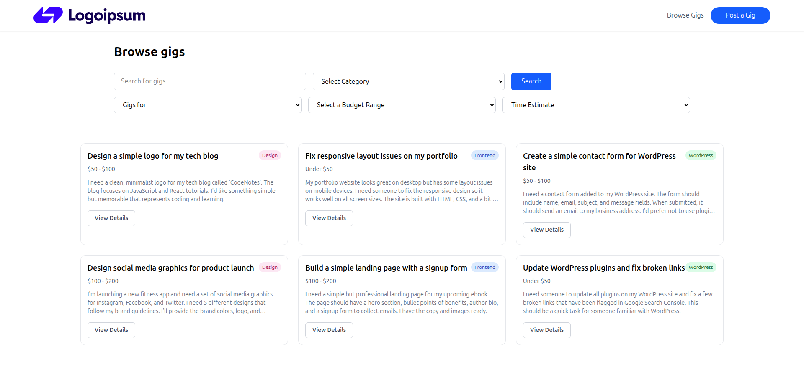

# GigBoard 🎯

A minimalist gig listing platform where users can browse freelance tasks by category, budget, and estimated time. Built with **React** and **Tailwind CSS**.

---

## ✨ Features

- 🔍 Filter gigs by **category**, **budget**, and **time estimate**
- 🧾 View gig **details** on a dedicated page
- 📧 "Apply Now" reveals **contact information** of the client
- 💡 Clean, responsive design using **TailwindCSS**
- ⚡ Optimized for quick navigation and user experience

---

## 🧱 Tech Stack

- **React** — Frontend library
- **React Router** — For navigation
- **Tailwind CSS** — Utility-first styling
- **Vite / CRA** — (Replace this with what you actually used)

---

## 🖼 Screenshots

> 🏠 Home Page  
> 

> 🧾 Gig Page
> 

---

## 🚀 Getting Started

```bash
# 1. Clone the repo
git clone https://github.com/your-username/gigboard.git

# 2. Install dependencies
cd gigboard
npm install

# 3. Run the app
npm run dev # or npm start
```
